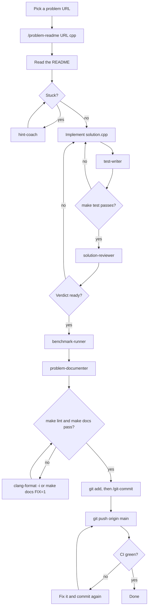

# Workflow: from a problem URL to GitHub

This is the whole path for one C++ problem: create it from a URL, solve it, let the agents test, review, benchmark and
document it, then commit and push it. The running example is LeetCode 219, *Contains Duplicate II*.

Everything here also works without Claude Code: each agent step can be done by hand, and the manual route is noted in
the step. The agents never commit and never stage files. Only you commit, with `/git-commit`. For what each agent does and what its
answer looks like, see [`AGENTS_USAGE.md`](AGENTS_USAGE.md). For every command, see [`USAGE.md`](USAGE.md).

## The flow at a glance



## Who does what

| Step | Who                       | Command or prompt                                     | Done when                                     |
|------|---------------------------|-------------------------------------------------------|-----------------------------------------------|
| 1    | `/problem-readme` skill   | `/problem-readme <url> cpp`                           | The folder exists and its README is filled    |
| 2    | You, plus `hint-coach`    | `use hint-coach on <folder>`                          | You have an approach                          |
| 3    | You                       | Edit `solution.h`, `solution.cpp`                     | It compiles                                   |
| 4    | `test-writer`             | `use test-writer on <folder>`                         | `make test` passes with real assertions       |
| 5    | `solution-reviewer`       | `use solution-reviewer on <folder>`                   | The verdict is `ready`                        |
| 6    | `benchmark-runner`        | `use benchmark-runner on <folder>`                    | The growth matches your complexity claim      |
| 7    | `problem-documenter`      | `use problem-documenter on <folder>`                  | README complete, pattern linked, index synced |
| 8    | You                       | `make test`, `make lint`, `make docs`                 | All three pass                                |
| 9    | You, plus `/git-commit`   | `git add <paths>`, then `/git-commit`                 | One commit with the message you approved      |
| 10   | You                       | `git push origin main`                                | CI is green                                   |

## Before you start

Do this once per machine:

```sh
g++ --version            # 10 or newer, because C++ problems are built with -std=c++20
clang-format --version   # used by make lint
npm install              # markdownlint for make docs (and the JS/TS tools)
make test                # a quick check that the toolchain works
```

Install commands for every tool are in [`USAGE.md` §2](USAGE.md#2-prerequisites). Claude Code loads skills and agents
when it starts, so restart it after pulling new ones.

## Step 1: create the problem from a URL

In Claude Code:

```txt
/problem-readme https://leetcode.com/problems/contains-duplicate-ii/ cpp
```

The skill fetches the title, difficulty, tags, examples and constraints, runs `make new` with the right number, slug,
title and link, and fills the README. The statement is paraphrased and the examples and constraints are copied as they
are. The **Approach** and **Complexity** sections stay `TODO` until you solve the problem. The result:

```txt
problems/leetcode/0219-contains-duplicate-ii/
  README.md        # statement, examples, constraints, difficulty, tags, link
  solution.h       # the declaration of solve(...)
  solution.cpp     # the implementation
  test.cpp         # assert-based tests (a stub at first)
  benchmark.cpp    # timing harness for five input sizes
```

**Without the skill:**

```sh
make new PLATFORM=leetcode LANG=cpp NUM=219 NAME=contains-duplicate-ii \
  URL=https://leetcode.com/problems/contains-duplicate-ii/ TITLE="Contains Duplicate II"
```

Then fill the README by hand. LeetCode's premium problems, Codeforces and unknown sites can't be fetched, so the skill
asks you to paste the statement. See [`USAGE.md` Step 4](USAGE.md#step-4--fill-in-the-problem-readme).

## Step 2: understand it, and get unstuck

Read the README's statement, examples and constraints. Note the limits (for example `nums.length <= 10^5`), because
they decide which complexity is enough.

If you are stuck, ask for a hint without the answer:

```txt
use hint-coach on problems/leetcode/0219-contains-duplicate-ii, I'm stuck
```

It answers one level at a time (reframe, direction, key idea, structure) and stops. Say `next hint` to go one level
deeper. It never writes solution code. To learn a technique in general, using other examples, ask
`use pattern-tutor to explain sliding window` instead.

## Step 3: implement the solution

Edit the two files. The scaffold declares a placeholder `int solve();` in `solution.h`, so replace it with the real
signature and implement it in `solution.cpp`:

```cpp
// solution.h
bool solve(const std::vector<int>& nums, int k);
```

Two things to remember in C++:

- `test.cpp` and `benchmark.cpp` still call `solve()` with no arguments. Update those calls to the new signature, or the
  build fails. The `test-writer` and `benchmark-runner` agents do this in the next steps.
- The standard is C++20, so features such as `unordered_map::contains` are fine. The style is Google-based with 4
  spaces and 100 columns (`.clang-format`).

To check that it compiles and behaves:

```sh
make test DIR=problems/leetcode/0219-contains-duplicate-ii
```

## Step 4: real tests

The scaffold's test only prints `TODO: add test cases`, so a green run means nothing yet. Ask for real ones:

```txt
use test-writer on problems/leetcode/0219-contains-duplicate-ii
```

It edits **only** `test.cpp`: the examples from the statement, edge cases (empty input, a single element, duplicates,
negatives, zero, sizes at the limits), and cases that separate a correct solution from a plausible wrong one. It works
out expected values by hand and reports `make test` and `make lint`. If a test fails and it thinks your solution is
wrong, it tells you the failing input and never edits your code. Then run it yourself:

```txt
▶ Running tests
━━━━━━━━━━━━━━━━━━━━━━━━━━━━━━━━━━━━━━━━━━━━━━━━━━━━━━━━
  ✓ PASS  cpp         problems/leetcode/0219-contains-duplicate-ii  0.47s
━━━━━━━━━━━━━━━━━━━━━━━━━━━━━━━━━━━━━━━━━━━━━━━━━━━━━━━━
 ✓ 1 passed   ✗ 0 failed   ○ 0 skipped   0.48s

All tests passed.
```

**Without the agent:** write `assert(...)` calls in `test.cpp` `main`. See
[`USAGE.md` Step 6](USAGE.md#step-6--write-real-test-cases).

## Step 5: review it

```txt
use solution-reviewer on problems/leetcode/0219-contains-duplicate-ii
```

The reviewer is read-only. It checks correctness, edge cases, whether your tests can actually fail, the complexity
claim, leftover stubs and idioms, and runs `make test` and `make lint`. It answers in a fixed shape:

```txt
Verdict: ready | needs changes | blocked

Blocking issues
- <file>:<line> — what is wrong, and a failing input if it has one

Should fix
- <file>:<line> — ...

Suggestions
- ...

make test: pass|fail|skipped   make lint: pass|fail|skipped
```

Fix what it finds, run it again, and move on when the verdict is `ready`. Blocking issues and "should fix" items are
worth doing before you commit; suggestions are optional.

**Without the agent:** read your own `git diff`, and check the list above by hand: the examples and edge cases, whether
your tests can fail, whether the complexity in your README matches the code, and that `make test` and `make lint` pass.

## Step 6: benchmark it

```txt
use benchmark-runner on problems/leetcode/0219-contains-duplicate-ii
```

It edits **only** `benchmark.cpp`: it writes the input builder (a worst-case, deterministic input) and runs the
benchmark two or three times. Or run it yourself:

```sh
make bench DIR=problems/leetcode/0219-contains-duplicate-ii
```

```txt
▶ Running benchmarks
━━━━━━━━━━━━━━━━━━━━━━━━━━━━━━━━━━━━━━━━━━━━━━━━━━━━━━━━
  ✓ DONE  cpp         problems/leetcode/0219-contains-duplicate-ii  0.99s
      │ size              min ms     median ms    growth
      │ 10              0.000264      0.000288         -
      │ 100             0.004667      0.005005     x17.7
      │ 1000            0.045612      0.046130      x9.8
      │ 10000           0.317762      0.335559      x7.0
      │ 100000          2.880667      3.553276      x9.1
━━━━━━━━━━━━━━━━━━━━━━━━━━━━━━━━━━━━━━━━━━━━━━━━━━━━━━━━
 ✓ 1 completed   ✗ 0 failed   ○ 0 skipped   1.01s
```

Read the `growth` column. Each size is 10x the one above, so `O(n)` shows about `x10`, `O(n log n)` about `x12` to
`x15`, and `O(n^2)` about `x100`. The first row is timer noise, so judge the trend from the larger sizes. Here the
solution grows about `x7` to `x10` per step, which matches the `O(n)` you would claim in the README.

## Step 7: finish the paperwork

```txt
use problem-documenter on problems/leetcode/0219-contains-duplicate-ii
```

It fills the README's **Approach** and **Complexity** from your actual code (no `TODO` left), adds a link to the problem
under the matching file in `patterns/` (a one-line insertion if that file has your uncommitted edits), and runs
`make index` so the root README's Problem Index lists the problem. It reports every file it changed and anything it was
unsure about.

**Without the agent:** write the two README sections, add a bullet such as
`- [leetcode/0219-contains-duplicate-ii](../problems/leetcode/0219-contains-duplicate-ii) (C++)` under `## Problems`
in the right `patterns/` file, and run `make index`.

## Step 8: run the checks

These are the same three commands CI runs. Run them for the problem before you commit:

```sh
make test DIR=problems/leetcode/0219-contains-duplicate-ii
make lint DIR=problems/leetcode/0219-contains-duplicate-ii
make docs
```

A passing lint run looks like this:

```txt
▶ Running lint
━━━━━━━━━━━━━━━━━━━━━━━━━━━━━━━━━━━━━━━━━━━━━━━━━━━━━━━━
  ✓ PASS  cpp         problems/leetcode/0219-contains-duplicate-ii  0.04s
━━━━━━━━━━━━━━━━━━━━━━━━━━━━━━━━━━━━━━━━━━━━━━━━━━━━━━━━
 ✓ 1 passed   ✗ 0 failed   ○ 0 skipped   0.05s

All lint checks passed.
```

When one fails:

| Failure                             | Fix                                                                                              |
|-------------------------------------|--------------------------------------------------------------------------------------------------|
| `make test` fails                   | Back to step 3 or 4. A failing test tells you the input, the expected value and the actual value |
| `make lint` reports C++ formatting  | In the problem folder: `clang-format -i solution.cpp solution.h test.cpp benchmark.cpp`          |
| `make docs` reports Markdown errors | `make docs FIX=1`, then fix what is left. The rules are in `.claude/rules/markdown.md`           |
| The Problem Index looks out of date | `make index`                                                                                     |

Claude Code also lints every Markdown file it edits (a hook), so most Markdown problems are caught while writing.

## Step 9: commit

Stage the files of this one problem, by path, and check what is staged:

```sh
git add problems/leetcode/0219-contains-duplicate-ii README.md patterns/
git status --short
```

If you are still editing other files in `patterns/`, add only the pattern file that got the link. Then, in Claude Code:

```txt
/git-commit
```

The skill reads what is staged and the recent history, drafts a Conventional Commits message, and shows you the full
message with the file list. It commits **only after you pick Commit**, and it commits exactly the text you approved.
You can also pick Edit to change it or Cancel to stop. A typical message:

```txt
feat(leetcode): solve 0219 contains-duplicate-ii in C++

Track the last index of each value in a hash map and check whether the
gap to the current index is within k. This is O(n) time instead of the
O(n*k) brute-force window scan.

Co-Authored-By: <the attribution line for your session>
```

If the changes span several scopes, the skill may suggest splitting, for example one commit for the problem and one
`docs(patterns): ...` for the pattern link. That is fine: approve each message in turn.

**Without Claude Code:** `git commit` with a message in the same style. See
[`USAGE.md` Step 10](USAGE.md#step-10--update-the-problem-index-and-commit).

## Step 10: push and watch CI

This repo commits straight to `main`:

```sh
git push origin main
```

GitHub Actions then runs `make test`, `make lint` and `make docs` on Ubuntu with every toolchain installed, so nothing
is skipped there. Watch it in the repository's Actions tab, or from the terminal with the GitHub CLI:

```sh
gh run watch
```

If it fails, open the failing step's log, fix the problem locally, and make a **new** commit (do not amend a commit you
have pushed), then push again. If you would rather review changes first, push a branch and open a pull request instead
of pushing to `main`.

## Done checklist

- [ ] The README has a statement, difficulty, tags, link, approach and complexity, and no `TODO`
- [ ] `solution.h` and `solution.cpp` implement the problem, and `test.cpp` and `benchmark.cpp` use the real signature
- [ ] `make test`, `make lint` and `make docs` pass
- [ ] The benchmark's growth matches the complexity in the README
- [ ] The problem is linked under a file in `patterns/`, and the Problem Index lists it
- [ ] One commit with an approved message, pushed, and CI is green

## Variations

- **Another language.** Use the language name in place of `cpp` (`go`, `python`, `javascript`, `typescript` or `rust`).
  The steps are the same. Only the files differ: for example `solution_test.go` and `test_solution.py` are the tests, and
  the formatter is `gofmt` or `ruff format` instead of `clang-format`. See [`USAGE.md` Step 3](USAGE.md#step-3--tour-of-the-generated-folder).
- **Another platform.** For Codeforces, Codewars or your own questions, only step 1 changes: the skill fetches Codewars
  and Codeforces metadata, and asks you to paste the statement when it can't fetch one.
- **No agents.** Skip the agent prompts and do each step by hand with the commands above. The checks and the commit
  message style stay the same.

## If something goes wrong

| Symptom                                      | Where to look                                                                                                         |
|----------------------------------------------|-----------------------------------------------------------------------------------------------------------------------|
| An agent or skill is not found               | Restart Claude Code, or open `/agents`. See [`AGENTS_USAGE.md` §6](AGENTS_USAGE.md#6-troubleshooting-and-customizing) |
| An agent says the solution is still a stub   | Finish step 3 first. `test-writer`, `benchmark-runner` and `problem-documenter` need a working `solve`                |
| A tool is missing or `make` skips a language | [`USAGE.md` §2](USAGE.md#2-prerequisites) and [§7](USAGE.md#7-troubleshooting)                                        |
| `make docs` says `run 'npm install' first`   | Run `npm install` once in the repo root                                                                               |
| CI fails but it passes on your machine       | Compare toolchain versions: CI uses Ubuntu's g++ and the versions pinned in `package.json`                            |
