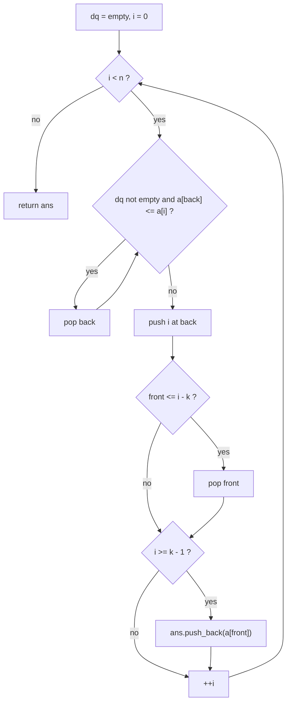
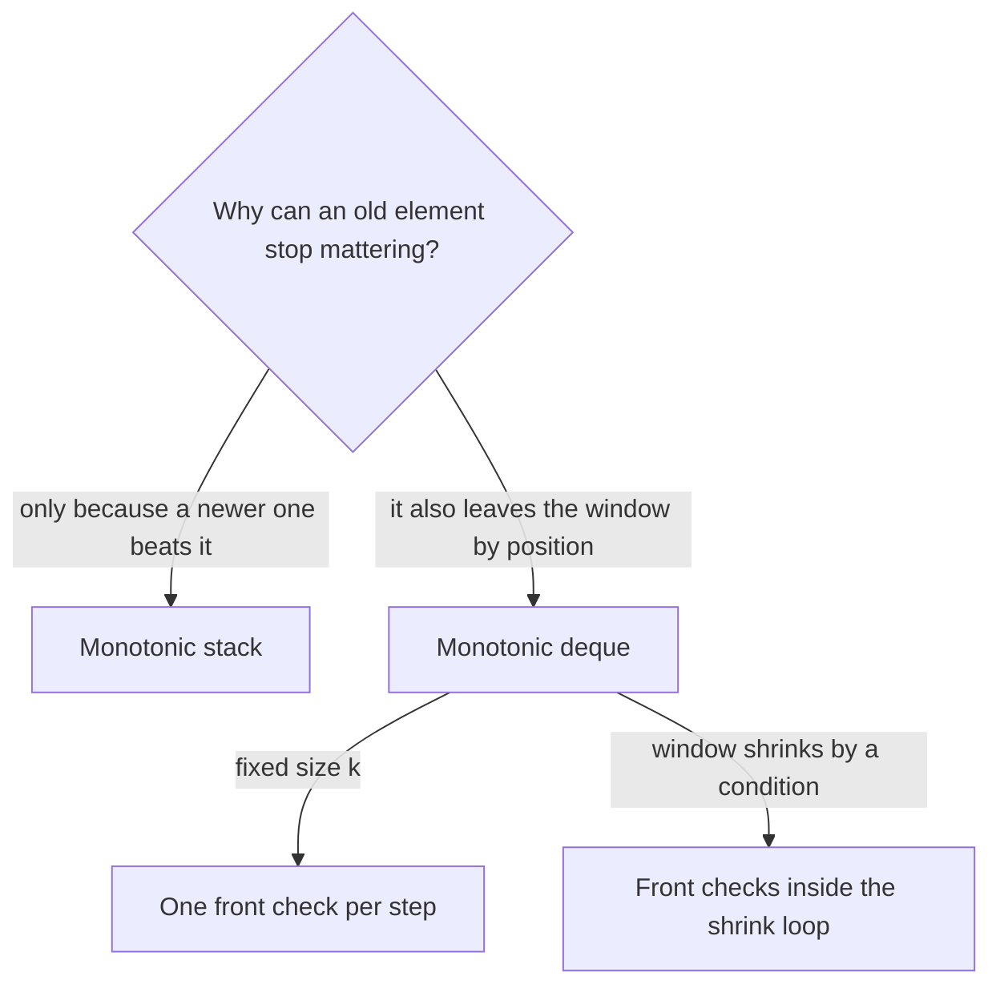

# Monotonic Queue

> Keep a deque of indices whose values stay sorted: new elements pop the useless ones off the back, expired ones leave from the front, and the front is always the window maximum (or minimum) in O(1).

## When to use

Signals in the statement:

- "Maximum (or minimum) of every subarray of size `k`": the classic sliding window maximum.
- A window that slides or grows and shrinks, and each step needs its current max or min, not a sum or a count.
- A DP transition like `dp[i] = a[i] + max(dp[j])` over `j` in `[i - k, i - 1]`: the max over a moving range of the
  previous states is exactly the deque's front.
- "Longest or shortest subarray where max minus min is at most `limit`": a variable window with two deques (one for the
  max, one for the min).
- The brute force is: for each window, rescan all `k` elements for the max. That rescan is what the deque replaces.

When NOT to use it:

- You only need a running sum, a count, or "distinct" characters. A plain sliding window or a prefix sum is enough.
- You need the nearest bigger or smaller neighbour and there is no window that drops old elements. That is a
  [monotonic-stack](monotonic-stack.md).
- Elements never expire (a prefix maximum). Then a single running max variable is enough.

## Core idea

Keep a deque of indices. Two rules keep it useful:

1. **Back: drop the dominated.** Before pushing `i`, pop every index at the back whose value is not better than `a[i]`.
   It is older and not bigger, so it will leave the window first and can never be the maximum again. The values in the
   deque are then strictly decreasing from front to back.
2. **Front: drop the expired.** If the index at the front is no longer inside the window, pop it.

The front is then the index of the maximum of the current window. For a window minimum, flip the comparison.

Window maximum on `a = {1, 3, 1, 2, 0, 5}` with `k = 3` (the deque holds indices, values in brackets):

```txt
 index:  0  1  2  3  4  5
 value: [1  3  1  2  0  5]

 i = 0 (1): push                          deque [0:1]
 i = 1 (3): pop back 0 (1 <= 3), push     deque [1:3]
 i = 2 (1): push                          deque [1:3, 2:1]        window 0..2 -> 3
 i = 3 (2): pop back 2 (1 <= 2), push     deque [1:3, 3:2]        window 1..3 -> 3
 i = 4 (0): push, front 1 <= 4-3, so drop deque [3:2, 4:0]        window 2..4 -> 2
 i = 5 (5): pop back 4, 3, push           deque [5:5]             window 3..5 -> 5
             front  back
```

Reading front to back, the values always fall (3, 2, 0). Only one element enters per step, so at most one element
can expire per step, and one `if` on the front is enough for the fixed window.

Decision flow of `windowMax` in the template. The state is the deque of indices. Each step cleans the back, pushes,
cleans the front, and reads the answer from the front once the first window is full:



Stack or deque, by what expires an element:



## Template

Two shapes: a fixed window (`windowMax`) and a variable window with two deques (`longestWithinLimit`). Both compile
with `g++ -std=c++20 -Wall -Wextra`.

```cpp
#include <algorithm>
#include <deque>
#include <iostream>
#include <vector>
using namespace std;

// Maximum of every window of size k (1 <= k <= n).
// The deque holds indices whose values are strictly decreasing from front to back,
// so the front is always the index of the current window maximum.
vector<int> windowMax(const vector<int>& a, int k) {
    int n = static_cast<int>(a.size());
    vector<int> ans;
    deque<int> dq;  // indices
    for (int i = 0; i < n; ++i) {
        // back is not larger than a[i] and older: it can never be a window maximum again
        while (!dq.empty() && a[dq.back()] <= a[i]) dq.pop_back();
        dq.push_back(i);
        if (dq.front() <= i - k) dq.pop_front();  // front left the window [i-k+1..i]
        if (i >= k - 1) ans.push_back(a[dq.front()]);
    }
    return ans;
}

// Longest subarray where max - min <= limit: a variable window with two deques.
int longestWithinLimit(const vector<int>& a, int limit) {
    int n = static_cast<int>(a.size());
    deque<int> maxd, mind;  // maxd: decreasing values, mind: increasing values (indices)
    int l = 0, best = 0;
    for (int r = 0; r < n; ++r) {
        while (!maxd.empty() && a[maxd.back()] <= a[r]) maxd.pop_back();
        maxd.push_back(r);
        while (!mind.empty() && a[mind.back()] >= a[r]) mind.pop_back();
        mind.push_back(r);
        while (a[maxd.front()] - a[mind.front()] > limit) {
            ++l;  // shrink from the left, then drop fronts that fell out
            if (maxd.front() < l) maxd.pop_front();
            if (mind.front() < l) mind.pop_front();
        }
        best = max(best, r - l + 1);
    }
    return best;
}

int main() {
    for (int x : windowMax({1, 3, -1, -3, 5, 3, 6, 7}, 3)) cout << x << ' ';
    cout << '\n';                                                     // 3 3 5 5 6 7
    cout << windowMax({4, 2}, 1).size() << '\n';                      // 2
    cout << longestWithinLimit({8, 2, 4, 7}, 4) << '\n';              // 2
    cout << longestWithinLimit({10, 1, 2, 4, 7, 2}, 5) << '\n';       // 4
    cout << longestWithinLimit({4, 2, 2, 2, 4, 4, 2, 2}, 0) << '\n';  // 3
}
```

## Walkthrough

`windowMax({1, 3, 1, 2, 0, 5}, 3)`:

| i | a[i] | pops at back | pop at front | deque after (indices) | ans      |
|---|------|--------------|--------------|-----------------------|----------|
| 0 | 1    | none         | no           | 0                     | none yet |
| 1 | 3    | 0            | no           | 1                     | none yet |
| 2 | 1    | none         | no           | 1, 2                  | 3        |
| 3 | 2    | 2            | no           | 1, 3                  | 3        |
| 4 | 0    | none         | 1            | 3, 4                  | 2        |
| 5 | 5    | 4, 3         | no           | 5                     | 5        |

Result `{3, 3, 2, 5}`. At `i = 4` the window is `[2..4]`, so index 1 has expired: `front = 1 <= 4 - 3`. Without that
check the answer would wrongly stay 3. At `i = 3`, index 2 (value 1) is popped from the back because `2` beats it and
will outlive it.

`longestWithinLimit({10, 1, 2, 4, 7, 2}, 5)`: the window grows to `[1, 2, 4]` (max 4, min 1), then adding 7 gives
`7 - 1 = 6 > 5`, so `l` moves right until the min deque's front (index 1) has left. The window is `[2, 4, 7]`, and adding
the last 2 gives `[2, 4, 7, 2]` with `7 - 2 = 5`, length 4. That is the answer.

## Variants

- **Fixed window, maximum or minimum**: the template above. Flip `<=` to `>=` for the minimum.
- **Variable window with a max-min condition**: two deques, one for the max and one for the min. Shrink `l` while the
  condition fails, and pop each front that fell below `l`.
- **DP over a range of previous states** (for example `dp[i] = a[i] + max(dp[i-k..i-1])`): keep the deque over `dp`
  instead of `a`, and read `dp[front]` before computing `dp[i]`.
- **Prefix sums with a deque** (shortest subarray with sum at least `K`, where values can be negative): the deque holds
  prefix-sum indices in increasing order of value, and the front is popped from the front while it satisfies the goal.
- **Strict vs non-strict pops** (`<` vs `<=`): with `<=` the deque holds only one copy of equal values (the newest).
  Both work for the maximum value; if you need the oldest or newest index of the maximum, pick the side deliberately.

## Complexity

- Time: O(n), where `n` is the array length. Each index is pushed once and popped at most once (from the back or from
  the front), so the `while` loops do at most `n` pops in total, even when one step pops many. `k` does not appear.
- Space: O(k) for the deque in the fixed-window shape (a strictly decreasing window fills it), O(n) for the output.
  In the variable-window shape the deque can hold up to `n` indices.

## Common mistakes and edge cases

- Storing values instead of indices. You need the index to know when the front has expired. Read the value with
  `a[dq.front()]`.
- Off-by-one on expiry. The window is `[i-k+1..i]`, so the front expires when `front <= i - k` (equivalently
  `front < i - k + 1`).
- Reading the answer before the first window is full. Start recording at `i >= k - 1`.
- Reading `dq.front()` or `dq.back()` on an empty deque is undefined behaviour. In `windowMax` the deque is never empty
  after the push. In the variable window, `l <= r` keeps the deques non-empty because the newest index is never dropped.
- Forgetting to drop a stale front in the variable window. Both deques must be checked against `l`, not only one.
- Calling it O(nk) or "O(n^2) because of the nested loop". The inner loops are amortized: count pops, not iterations.
- Using `k` larger than `n` or `k = 0`. The template assumes `1 <= k <= n`, so check the constraints or guard for it.
  step at a time and checks each front, so it stays correct.

## Related patterns

- Monotonic stack: see [monotonic-stack](monotonic-stack.md). Same idea of popping dominated elements from the back.
  The difference is expiry. A stack only ever loses an element because a newer one beats it, so it answers "nearest
  bigger or smaller neighbour". A queue also loses elements from the front because they left the window, so it answers
  "max or min of the current window". A deque is a stack that can also be popped from the other end.
- Sliding window: a plain sliding window keeps a running sum, count or set and updates it in O(1) as elements enter and
  leave. It cannot keep a max or min, because you cannot "subtract" a maximum when its element leaves. The monotonic
  queue is the tool that gives a sliding window a max or min. Use the plain window when the state is additive, and add
  the deque when the condition is about the max or min. There is no separate sliding-window file yet, so see
  [two-pointers](two-pointers.md) for how the two ends of a window move.
- Heap or ordered multiset: also gives a window max or min, in O(n log k) with lazy deletion or a multiset. The deque
  does it in O(n) but only because the window slides in order.

## Practice ladder

Check the difficulty labels on the site. Scaffold one with `/problem-readme`. There is no Easy problem that needs a
deque, so warm up with the monotonic stack file first.

- LeetCode 1696: Jump Game VI (Medium)
- LeetCode 1438: Longest Continuous Subarray With Absolute Diff Less Than or Equal to Limit (Medium)
- LeetCode 239: Sliding Window Maximum (Hard)
- LeetCode 1425: Constrained Subsequence Sum (Hard)
- LeetCode 862: Shortest Subarray with Sum at Least K (Hard)

## Problems
