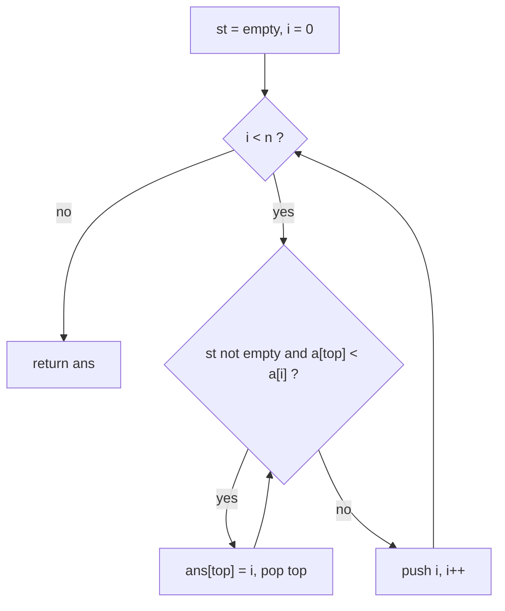
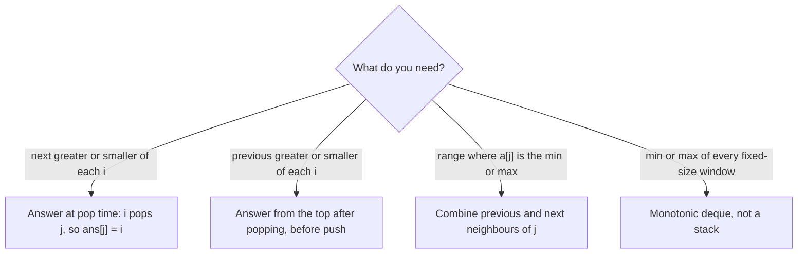

# Monotonic Stack

> Keep a stack whose values stay sorted, and throw away every element a new one makes useless; each element is pushed once and popped once, so "nearest greater or smaller neighbour" questions take O(n) instead of O(n^2).

## Definition

A **monotonic stack** is an ordinary stack with one rule: the values inside it are always sorted, either increasing or
decreasing from bottom to top. Before you push a new element, you pop every element that would break that order.

The pattern answers questions of the form "for each position, what is the nearest position on the left (or right)
whose value is greater (or smaller)?". The brute force scans outward from every position, which costs O(n^2). The stack
replaces that scan.

In this file, "increasing stack" means the values rise from bottom to top, and "decreasing stack" means they fall.

## How it works

State: a stack of **indices** (not values), plus an answer array. You read the value with `a[st.back()]`. Storing
indices lets you compute distances and widths later.

Take "next greater element" (the nearest larger value to the right of each position). Use a decreasing stack:

1. Scan the array left to right. The stack holds positions that are still waiting for their next greater element.
2. At position `i`, look at the top of the stack. While `a[top] < a[i]`, then `a[i]` is the first larger value to the
   right of `top`. Record `ans[top] = i` and pop it.
3. Stop popping when the stack is empty or `a[top] >= a[i]`.
4. Push `i`. It now waits for its own answer.
5. After the last element, whatever is still on the stack never found a greater value. Those keep the default answer
   (`-1`).

Why it is correct: the stack is decreasing, so when `a[i]` arrives, the elements it can answer are exactly the ones on
top (the smallest waiting values). The first one that `a[i]` does not beat is larger or equal, and everything below it
is larger still, so none of them can be answered by `a[i]`. Popping is also safe: once `top` has its answer it never
needs to be looked at again. And no waiting element is skipped, because the elements between it and `i` were all
smaller or equal (otherwise they would have popped it earlier).

Each index is pushed once and popped at most once, so the total work is linear even though one step can pop many
elements.

Two ways to read the answer, depending on the question:

- **At pop time** (used above): when `i` pops `j`, then `i` is the next greater or smaller of `j`.
- **From the top before pushing**: after popping, the new top is the nearest previous smaller or greater of `i`. This
  is the mirror image, and it is what you use for the "left neighbour" side.

Flip the comparison to switch between greater and smaller. Use `<` versus `<=` to decide how equal values behave.

## Complexity

- Time: O(n), where `n` is the array length. Each index is pushed once and popped at most once, so all the inner `while`
  loops together do at most `n` pops. One iteration can pop many, but the total is bounded (amortized O(1) per element).
- Space: O(n). The stack holds up to `n` indices (a strictly decreasing input never pops in the next-greater scan),
  plus the O(n) output.

## Diagram

Next greater element on `a = {2, 7, 4, 5, 1, 6}`. The stack shows `index:value`, and the answer is the index of the
next greater value (`-1` if none):

```txt
 index:  0  1  2  3  4  5
 value: [2  7  4  5  1  6]

 i = 0 (2): stack empty                    push 0            stack [0:2]
 i = 1 (7): 2 < 7  pop 0 -> ans[0] = 1     push 1            stack [1:7]
 i = 2 (4): 7 < 4? no                      push 2            stack [1:7, 2:4]
 i = 3 (5): 4 < 5  pop 2 -> ans[2] = 3     push 3            stack [1:7, 3:5]
 i = 4 (1): 5 < 1? no                      push 4            stack [1:7, 3:5, 4:1]
 i = 5 (6): 1 < 6  pop 4 -> ans[4] = 5
            5 < 6  pop 3 -> ans[3] = 5
            7 < 6? no                      push 5            stack [1:7, 5:6]
 end:       indices 1 and 5 are left       ans stays -1

 ans = { 1, -1, 3, 5, 5, -1 }
```

Reading the stack from bottom to top, the values never rise (7, 5, 1 and then 7, 6). That is the "monotonic" part.

## Mermaid diagram

Decision flow of the scan. The state is the stack of indices; each new element pops what it beats, then pushes itself:



Which shape to pick, by what you need from the stack:



## How to recognize it

Signals in the statement:

- "Next greater element", "next smaller element", "previous greater or smaller": for each position, find the nearest
  position on one side with a larger or smaller value.
- "How many days until ..." or "how far back until ...": a distance to the nearest position that beats the current one.
- Each element is the minimum or maximum of some range, and you need the extent of that range (histogram rectangles,
  sum of subarray minimums, trapping water).
- The brute force is "for each `i`, scan left or right until something bigger or smaller shows up". That scan is what
  the stack replaces.
- Removing elements so the result is the smallest or largest in lexicographic order (for example, remove k digits).
- Matching or nesting structure where the latest unresolved item is the one to resolve first.

Constraints: `n` up to about 10^5 or 10^6 rules out the O(n^2) scan and points to a linear pass.

When it does NOT apply:

- The condition is not about a value order (a sum, a count, distinct characters). That is a sliding window or a prefix
  sum.
- You need the min or max of every window of a fixed size. A monotonic deque is the tool, because the window also has
  to drop old elements from the other end. See [monotonic-queue](monotonic-queue.md).
- The array is already sorted: the nearest greater neighbour is trivially the next element.
- You only need to match brackets or undo the last action, with no value ordering. That is a plain stack, see
  [stack](stack.md).

Example problems, to scaffold with `/problem-readme` (double-check the difficulty labels): LeetCode 496: Next Greater
Element I, LeetCode 739: Daily Temperatures, LeetCode 84: Largest Rectangle in Histogram.

## Common mistakes

- Storing values when you need distances or extents. Store indices, and read the value with `a[st.back()]`.
- Wrong strictness (`<` versus `<=`) with duplicates. Test with all elements equal. When you combine a previous and a
  next neighbour (sum of subarray minimums), one side must be strict and the other non-strict, or equal values get
  counted twice or missed.
- Reading the top when the stack is empty. Check `st.empty()` first, and decide what "no neighbour" returns (`-1`, `n`,
  or `0`).
- Forgetting the elements left on the stack at the end. In the answer-at-pop shape they keep the default. In the
  histogram problem they still need processing, which is why that solution appends a sentinel height 0 at `i == n`.
- Calling it O(n^2) because of the nested loop. The inner loop is amortized: count pops, not iterations.
- Overflow in results such as `height * width` or sums of minimums. Use `long long` when the constraints allow it.
- Using a stack for a fixed-size window. Old elements have to leave from the other end, which needs a deque.

## Code example

One function: next greater element, answer at pop time.

```cpp
#include <iostream>
#include <vector>

// For each i, the index of the nearest element to the right that is strictly greater
// than a[i], or -1 if there is none.
std::vector<int> nextGreater(const std::vector<int>& a) {
    std::vector<int> ans(a.size(), -1);
    std::vector<int> st;  // indices; their values are non-increasing from bottom to top
    for (int i = 0; i < static_cast<int>(a.size()); ++i) {
        while (!st.empty() && a[st.back()] < a[i]) {
            ans[st.back()] = i;  // a[i] is the first greater value to the right of st.back()
            st.pop_back();
        }
        st.push_back(i);
    }
    return ans;  // indices left on the stack keep -1
}

int main() {
    for (int x : nextGreater({2, 7, 4, 5, 1, 6})) std::cout << x << ' ';
    std::cout << '\n';  // 1 -1 3 5 5 -1
    for (int x : nextGreater({3, 3, 3})) std::cout << x << ' ';
    std::cout << '\n';  // -1 -1 -1
}
```

What each part does:

- `ans` starts as all `-1`, which is the answer for "no greater element". Only elements that get popped are updated.
- `st` holds the indices that are still waiting for a greater value. Because we pop everything smaller than `a[i]`
  before pushing `i`, the values on the stack never increase from bottom to top.
- The `while` loop is the heart of the pattern. `a[st.back()] < a[i]` means `i` is the first larger value to the right
  of `st.back()`, so we record the answer and drop it from the waiting list.
- The comparison is strict (`<`), so an equal value does not count as greater. That is why `{3, 3, 3}` gives all `-1`.
- After the loop, whatever is still on the stack found nothing greater, and its answer is already `-1`.

Trace on `{2, 7, 4, 5, 1, 6}` (the stack shows `index:value`):

1. `i = 0` (2): the stack is empty, push 0. Stack `[0:2]`.
2. `i = 1` (7): `2 < 7`, so `ans[0] = 1` and pop 0. Push 1. Stack `[1:7]`.
3. `i = 2` (4): `7 < 4` is false. Push 2. Stack `[1:7, 2:4]`.
4. `i = 3` (5): `4 < 5`, so `ans[2] = 3` and pop 2. `7 < 5` is false. Push 3. Stack `[1:7, 3:5]`.
5. `i = 4` (1): `5 < 1` is false. Push 4. Stack `[1:7, 3:5, 4:1]`.
6. `i = 5` (6): `1 < 6`, so `ans[4] = 5`, pop. `5 < 6`, so `ans[3] = 5`, pop. `7 < 6` is false. Push 5. Stack
   `[1:7, 5:6]`.
7. The loop ends. Indices 1 and 5 were never popped, so `ans[1]` and `ans[5]` stay `-1`.

Result: `1 -1 3 5 5 -1`, which matches the printed output.

## Summary

| Part         | Summary                                                                                     |
|--------------|---------------------------------------------------------------------------------------------|
| Mental model | A waiting list of indices kept sorted by value; a new element resolves everyone it beats.   |
| Template     | `st` of indices; `while top loses to a[i]`: answer it and pop; then push `i`.               |
| Recognize    | Next or previous greater or smaller, "days until", range where an element is min or max.    |
| Mistakes     | Storing values not indices, wrong `<` vs `<=` on ties, empty-stack reads, leftovers unused. |

## Problems

- [leetcode/0496-next-greater-element-i](../problems/leetcode/0496-next-greater-element-i) (C++)
