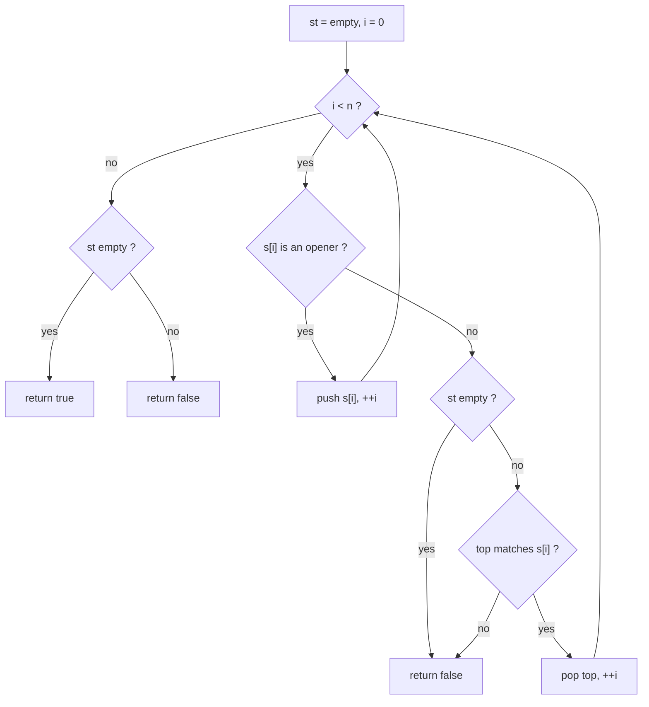
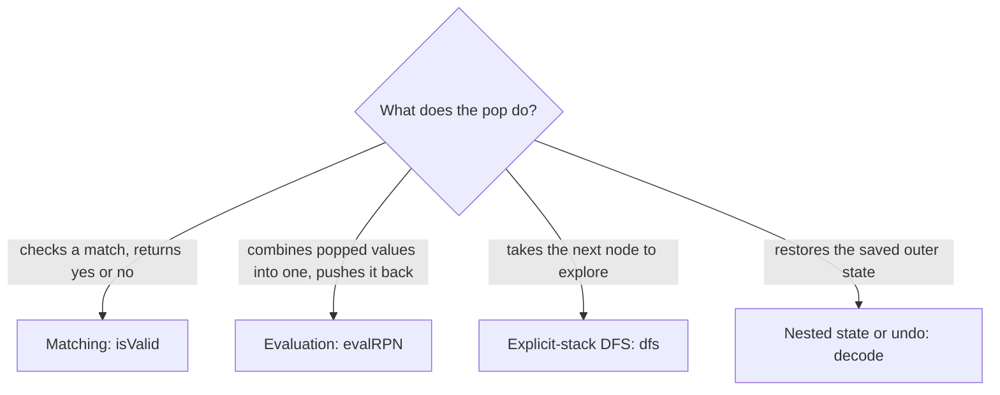

# Stack

> Last in, first out: keep the things you have started but not finished on a stack, and the top is always the one to deal with next.

## When to use

Signals in the statement:

- Brackets, tags or nested structure: "valid parentheses", "well-formed", "balanced", "decode `3[a2[c]]`".
- Each closing thing must match the most recent opening thing that is still open.
- Expressions: postfix (Reverse Polish Notation), a calculator with `+ - * /` and parentheses, or a path such as
  `/a/./b/../c` where `..` cancels the last name.
- "Undo", "backspace", "remove the last one", "cancel adjacent duplicates": the newest item is the one that gets removed.
- The problem is naturally recursive, but the depth could blow the call stack, or you need to pause and resume
  (iterative DFS, in-order traversal, nested lists).
- Logs of nested calls (function start and end times): the function that started last ends first.

When NOT to use it:

- You need the nearest smaller or greater value for each element. The stack is still the tool, but it has to stay
  sorted: see [monotonic-stack](monotonic-stack.md).
- You need the shortest path in an unweighted graph or a level-by-level order. That is a queue (BFS), because the
  oldest item must go first.
- Items must leave from both ends (a sliding window): see [monotonic-queue](monotonic-queue.md) for the deque version.
- You only compare two positions in a sorted array: see [two-pointers](two-pointers.md).

## Core idea

A stack only lets you touch the top: `push`, `pop`, `top`. Whatever you opened last is closed first. So the stack
holds "work in progress", in nesting order. On each step you either start something (push), or finish something (pop
and combine it with what is below).

Bracket matching on `{[()]}`. The stack is drawn with the top on the right:

```txt
 input:  {   [   (   )   ]   }

 read {  push          stack: [ { ]
 read [  push          stack: [ {  [ ]
 read (  push          stack: [ {  [  ( ]
 read )  top is (  pop stack: [ {  [ ]
 read ]  top is [  pop stack: [ { ]
 read }  top is {  pop stack: [ ]        empty at the end -> valid
```

Decision flow of `isValid` in the template. The state is the stack of open brackets. An opener is pushed, a closer
must find its partner on top:



The same "push what is open, pop when it closes" idea shows up in four shapes. Pick by what the pop does:



## Template

Four shapes on one idea. In C++ a `vector` used with `push_back`, `back` and `pop_back` is a stack, and it is easier to
inspect than `std::stack`. Every function below compiles with `g++ -std=c++20 -Wall -Wextra` and prints the values in
the comments.

```cpp
#include <iostream>
#include <string>
#include <vector>
using namespace std;

// Shape 1: match and nest. Push openers, and each closer must match the top.
bool isValid(const string& s) {
    vector<char> st;
    for (char c : s) {
        if (c == '(' || c == '[' || c == '{') {
            st.push_back(c);
        } else {
            if (st.empty()) return false;  // closer with nothing to close
            char open = st.back();
            st.pop_back();
            bool ok = (open == '(' && c == ')') || (open == '[' && c == ']') ||
                      (open == '{' && c == '}');
            if (!ok) return false;  // closer does not match the innermost opener
        }
    }
    return st.empty();  // leftover openers were never closed
}

// Shape 2: evaluate postfix (RPN). Operands are pushed, an operator pops two and pushes one.
int evalRPN(const vector<string>& tokens) {
    vector<int> st;
    for (const string& t : tokens) {
        if (t == "+" || t == "-" || t == "*" || t == "/") {
            int b = st.back();
            st.pop_back();  // right operand comes off first
            int a = st.back();
            st.pop_back();
            if (t == "+") st.push_back(a + b);
            else if (t == "-") st.push_back(a - b);
            else if (t == "*") st.push_back(a * b);
            else st.push_back(a / b);
        } else {
            st.push_back(stoi(t));
        }
    }
    return st.back();
}

// Shape 3: DFS with an explicit stack instead of recursion. Returns the visit order.
vector<int> dfs(const vector<vector<int>>& adj, int start) {
    vector<int> order;
    vector<bool> seen(adj.size(), false);
    vector<int> st = {start};
    while (!st.empty()) {
        int u = st.back();
        st.pop_back();
        if (seen[u]) continue;  // mark on pop, so a node pushed twice is handled once
        seen[u] = true;
        order.push_back(u);
        for (auto it = adj[u].rbegin(); it != adj[u].rend(); ++it)  // reversed: first neighbour on top
            if (!seen[*it]) st.push_back(*it);
    }
    return order;
}

// Shape 4: undo / nested state. Decode "3[a2[c]]" with one stack of (count, text so far).
string decode(const string& s) {
    vector<pair<int, string>> st;
    string cur;
    int k = 0;
    for (char c : s) {
        if (isdigit(c)) {
            k = k * 10 + (c - '0');
        } else if (c == '[') {
            st.push_back({k, cur});  // save the outer state, start a fresh inner one
            k = 0;
            cur.clear();
        } else if (c == ']') {
            auto [times, outer] = st.back();
            st.pop_back();
            string rep;
            for (int i = 0; i < times; ++i) rep += cur;
            cur = outer + rep;  // restore the outer state
        } else {
            cur += c;
        }
    }
    return cur;
}

int main() {
    cout << isValid("{[()]}") << isValid("([)]") << isValid("((") << isValid("") << '\n';  // 1001
    cout << evalRPN({"2", "1", "+", "3", "*"}) << '\n';                                  // 9
    cout << evalRPN({"4", "13", "5", "/", "+"}) << '\n';                                 // 6
    vector<vector<int>> adj = {{1, 2}, {3}, {3}, {}};
    for (int x : dfs(adj, 0)) cout << x << ' ';
    cout << '\n';                                    // 0 1 3 2
    cout << decode("3[a2[c]]") << '\n';              // accaccacc
}
```

## Walkthrough

`isValid("([)]")`. The `)` arrives while the top is `[`, so the nesting is broken:

| i | s[i] | action                        | stack after (bottom to top) |
|---|------|-------------------------------|-----------------------------|
| 0 | (    | opener, push                  | (                           |
| 1 | [    | opener, push                  | (, [                        |
| 2 | )    | top is `[`, no match, false   | (, [                        |

`evalRPN({"2", "1", "+", "3", "*"})`, which is `(2 + 1) * 3`:

| token | action                          | stack after |
|-------|---------------------------------|-------------|
| 2     | operand, push                   | 2           |
| 1     | operand, push                   | 2, 1        |
| +     | pop b = 1, pop a = 2, push 3    | 3           |
| 3     | operand, push                   | 3, 3        |
| *     | pop b = 3, pop a = 3, push 9    | 9           |

The answer is the only value left, `9`. Pop order matters for `-` and `/`: the first pop is the right operand `b`.

`dfs` on `adj = {{1, 2}, {3}, {3}, {}}` (edges 0-1, 0-2, 1-3, 2-3): the stack starts as `[0]`. Pop 0, visit it, push
2 then 1, so 1 is on top. Pop 1, visit, push 3. Pop 3, visit. Pop 2, visit, and 3 is already seen, so nothing is
pushed. The order is `0 1 3 2`, the same as recursion that tries neighbours in list order.

## Variants

- **Matching** (`isValid`): push openers, pop on closers. Extend it with a second value (the index, a tag name) when
  you must report where the mismatch is.
- **Evaluation**: postfix needs only one stack of values. Infix with precedence uses two stacks (values and
  operators), or one stack plus "the last operator seen" (calculator problems): on `+` or `-` push a signed number, on
  `*` or `/` combine with the top at once.
- **Explicit-stack DFS**: replaces recursion. Mark visited on pop (as in the template) or on push, but be consistent.
  For trees, in-order and post-order traversals need a little more state than pre-order.
- **Simulating recursion**: push a frame (the arguments and where to resume) instead of calling the function. Use it
  when the depth may overflow the call stack.
- **Nested state or undo** (`decode`): on an opener, save the current state on the stack and start fresh. On a closer,
  pop and merge. Also covers backspace strings and simplifying a file path.
- **Adjacent-duplicate removal**: push each element, and if it equals the top, pop instead of pushing.
- **Stack with extra data** (min stack): push a pair `(value, min so far)` so every push remembers the answer for the
  state below it.

## Complexity

- Time: O(n), where `n` is the length of the input (characters, tokens) or, for DFS, O(V + E) with `V` nodes and `E`
  edges. Each item is pushed and popped a constant number of times. In the DFS template a node can be pushed once per
  incoming edge, which is still O(E) pushes.
- Space: O(n) for the stack in the worst case (all openers, a long chain of nested brackets, a path-shaped graph). For
  DFS the stack can hold up to O(E) entries in the template, since a node may be pushed more than once.

## Common mistakes and edge cases

- Popping or reading `back()` from an empty stack. It is undefined behaviour in C++. Check `empty()` first: a closer
  can arrive before any opener (`")("`).
- Returning `true` without checking the stack is empty at the end (`"(("` is invalid).
- Operand order for `-` and `/`: the first pop is the right side. Swapping them gives `b - a`.
- Integer division and parsing: RPN division truncates toward zero, and tokens like `"-11"` are numbers, not the
  operator `-`. Compare the whole token, not its first character.
- Multi-digit numbers in `decode` (`"10[a]"`): build the count digit by digit, as the template does.
- Marking visited on push in DFS and expecting the recursive visit order. It changes the order for graphs with
  cycles or shared children. Mark on pop to match recursion.
- Pushing neighbours in list order and expecting the first one to be visited first. It is on the bottom, so push them
  reversed (as the template does), or accept the reversed order.
- Reaching for a stack when the oldest item must go first. That is a queue.

## Related patterns

- Monotonic stack: see [monotonic-stack](monotonic-stack.md). A plain stack is about matching and nesting order: what
  you pop is decided by what it is (a partner bracket, an operator), and the values need no order. A monotonic stack
  is about value order: it pops while the top is bigger or smaller than the new element, so the stack stays sorted and
  the top is the nearest smaller or greater neighbour. If the statement says "next greater", go there.
- Monotonic queue: see [monotonic-queue](monotonic-queue.md). It is the same sorted idea, but items also leave from
  the front, which a stack cannot do.
- Two pointers: see [two-pointers](two-pointers.md). Palindrome checks and "compare from both ends" can look like a
  stack job (push half, pop and compare), but two pointers does it in O(1) space.

## Practice ladder

Check the difficulty labels on the site. Scaffold one with `/problem-readme`.

- LeetCode 20: Valid Parentheses (Easy)
- LeetCode 1047: Remove All Adjacent Duplicates In String (Easy)
- LeetCode 232: Implement Queue using Stacks (Easy)
- LeetCode 144: Binary Tree Preorder Traversal (Easy)
- LeetCode 155: Min Stack (Medium)
- LeetCode 150: Evaluate Reverse Polish Notation (Medium)
- LeetCode 71: Simplify Path (Medium)
- LeetCode 394: Decode String (Medium)
- LeetCode 227: Basic Calculator II (Medium)
- LeetCode 224: Basic Calculator (Hard)

## Problems
