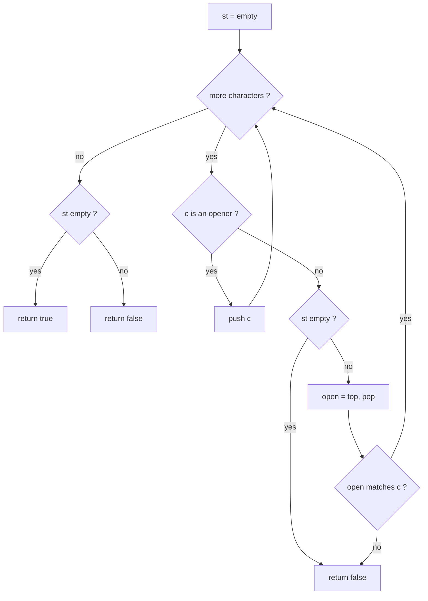
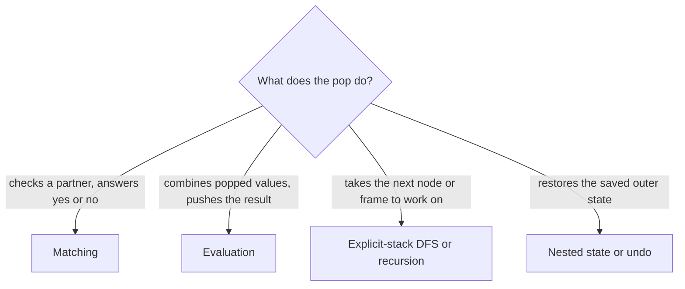

# Stack

> Last in, first out: keep the things you have started but not finished on a stack, and the top is always the one to deal with next.

## Definition

A stack is a list where you only touch one end, the top. It has three operations: `push` (put an item on top), `pop`
(remove the top item) and `top` (look at it). The last item pushed is the first one popped. This rule is called LIFO,
last in, first out.

As a problem-solving pattern, the stack holds work that has been started but is not finished yet, in nesting order. The
innermost, most recent thing is always on top, so it is the next one to finish. Typical jobs:

- Matching brackets and other nested structure.
- Evaluating expressions (postfix, calculators, paths with `..`).
- Undo, backspace and "cancel the last one" rules.
- Simulating recursion, including DFS with an explicit stack instead of function calls.

## How it works

State: one stack, plus (depending on the problem) the current position in the input. In C++ a `std::vector` used with
`push_back`, `back` and `pop_back` is a stack, and it is easy to print while debugging.

The loop reads the input one item at a time and does one of two things:

1. **Start something.** The item opens a new piece of work (an opening bracket, an operand, a node to visit later, a
   saved outer state). Push it.
2. **Finish something.** The item closes work (a closing bracket, an operator, a finished child). The thing it must
   close is the most recent unfinished one, which is exactly the top. Pop it, check it or combine it with the item, and
   sometimes push a result back.

The loop stops when the input is used up (or a check fails early). What is left on the stack at the end is the answer
to "was everything finished?": for bracket matching the stack must be empty, for an expression it holds the result.

Why it is correct: nesting is last-opened, first-closed. Between an opener and its closer everything else must be
opened and closed too, so at the moment a closer arrives, the only opener it may match is the innermost one that is
still open, and that one is the top. Older items below it cannot be finished before the ones above them, so they can
safely wait. The stack is the smallest memory that keeps exactly this order.

The same idea appears in four common shapes. Pick by what the pop does:

- **Matching:** pop and check that it is the right partner (brackets, tags).
- **Evaluation:** pop the operands, combine them, push the result (RPN, calculators).
- **Explicit-stack DFS or recursion:** pop the next node or frame to work on, push its children or sub-calls.
- **Nested state or undo:** pop to restore the saved outer state, or to remove the last item (decode `3[a2[c]]`,
  backspace, simplify a path, remove adjacent duplicates).

## Complexity

- Time: O(n), where `n` is the number of input items (characters, tokens). Each item is pushed at most once and popped
  at most once, so the total work is a constant per item. For DFS it is O(V + E), with `V` nodes and `E` edges, since
  every edge is looked at a constant number of times.
- Space: O(n) in the worst case for the stack itself, when everything is pushed and nothing is popped (a string of only
  openers such as `"((((("`, or a path-shaped graph for DFS). Bracket matching of `"()()()"` never holds more than one
  item, so the space depends on the nesting depth, not always on `n`.

## Diagram

Bracket matching on `{[()]}`, with the top of the stack on the right:

```txt
 input:  {   [   (   )   ]   }

 read {  push            stack: [ {         ]
 read [  push            stack: [ {  [      ]
 read (  push            stack: [ {  [  (   ]
 read )  top is (, pop   stack: [ {  [      ]
 read ]  top is [, pop   stack: [ {         ]
 read }  top is {, pop   stack: [           ]     empty at the end -> valid
```

A broken input, `([)]`. The `)` arrives while the top is `[`, so the nesting is wrong and we stop:

```txt
 input:  (   [   )   ]

 read (  push            stack: [ (         ]
 read [  push            stack: [ (  [      ]
 read )  top is [, pop   [ does not match ) -> invalid
```

## Mermaid diagram

Decision flow of the bracket-matching loop in the code example. The state is the stack of open brackets:



The four shapes and how to pick between them:



## How to recognize it

Signals in the statement:

- Brackets, tags or nested structure: "valid parentheses", "well-formed", "balanced", "decode `3[a2[c]]`".
- Each closing thing must match the most recent opening thing that is still open.
- Expressions: postfix (Reverse Polish Notation), a calculator with `+ - * /` and parentheses, or a path such as
  `/a/./b/../c` where `..` cancels the last name.
- "Undo", "backspace", "remove the last one", "cancel adjacent duplicates": the newest item is the one that gets
  removed.
- The problem is naturally recursive, but the depth could overflow the call stack, or you need to pause and resume
  (iterative DFS, in-order traversal, nested lists).
- Logs of nested calls (function start and end times): the function that started last ends first.

When it does NOT apply:

- You need the nearest smaller or greater value for each element. A stack is still the tool, but it must stay sorted:
  see [monotonic-stack](monotonic-stack.md).
- You need the shortest path in an unweighted graph or a level-by-level order. That is a queue (BFS), because the
  oldest item must go first.
- Items must leave from both ends (a sliding window): see [monotonic-queue](monotonic-queue.md) for the deque version.
- You only compare two positions in a sorted array, or check a palindrome: see [two-pointers](two-pointers.md), which
  needs O(1) space where a stack needs O(n).

Difference from a monotonic stack: a plain stack decides what to pop by what the item is (a partner bracket, an
operator), and the values need no order. A monotonic stack pops while the top is bigger or smaller than the new
element, so the stack stays sorted and the top is the nearest smaller or greater neighbour.

Problems that fit (double-check the difficulty labels on the site, and scaffold one with `/problem-readme`):
LeetCode 20: Valid Parentheses, LeetCode 150: Evaluate Reverse Polish Notation, LeetCode 394: Decode String,
LeetCode 71: Simplify Path.

## Common mistakes

- Popping or reading `back()` from an empty stack. It is undefined behaviour in C++. Check `empty()` first: a closer
  can arrive before any opener (`")("`).
- Returning `true` without checking that the stack is empty at the end (`"(("` is invalid).
- Operand order for `-` and `/` in expression evaluation: the first pop is the right operand, so `a - b` needs `b`
  popped first. Swapping them gives `b - a`.
- Comparing only the first character of a token in RPN. `"-11"` is a number, not the operator `-`. Compare the whole
  token.
- Building multi-digit numbers wrongly in nested-state problems (`"10[a]"`): accumulate the count digit by digit.
- In explicit-stack DFS, marking visited on push and expecting the recursive visit order. It changes the order for
  graphs with cycles or shared children. Mark on pop to match recursion, and push neighbours in reverse so the first
  one is on top.
- Reaching for a stack when the oldest item must go first. That is a queue.

## Code example

Bracket matching (the shape used by LeetCode 20). Push each opener, and let each closer pop the top and check that it
is its partner.

```cpp
#include <string>
#include <vector>

bool isValid(const std::string& s) {
    std::vector<char> st;  // open brackets that are not closed yet, top = back
    for (char c : s) {
        if (c == '(' || c == '[' || c == '{') {
            st.push_back(c);
            continue;
        }
        if (st.empty()) return false;  // closer with nothing to close
        char open = st.back();
        st.pop_back();
        bool ok =
            (open == '(' && c == ')') || (open == '[' && c == ']') || (open == '{' && c == '}');
        if (!ok) return false;  // closer does not match the innermost opener
    }
    return st.empty();  // leftover openers were never closed
}

// isValid("{[()]}") -> true
// isValid("([)]")   -> false
// isValid("((")     -> false
// isValid(")(")     -> false
// isValid("")       -> true
```

How it works:

- `st` is the stack. `push_back`, `back` and `pop_back` are push, top and pop.
- An opener has nothing to match yet, so it is pushed and the loop moves on.
- A closer must close the innermost open bracket. If the stack is empty there is nothing to close, so the string is
  invalid. Otherwise pop the top and compare it with the closer. A mismatch means the nesting is broken.
- After the loop, any bracket still on the stack was opened and never closed, so the string is valid only if the stack
  is empty.

Trace on `{[()]}`:

1. `{` is an opener: push. Stack `{`.
2. `[` is an opener: push. Stack `{ [`.
3. `(` is an opener: push. Stack `{ [ (`.
4. `)` is a closer: pop `(`, it matches. Stack `{ [`.
5. `]` is a closer: pop `[`, it matches. Stack `{`.
6. `}` is a closer: pop `{`, it matches. Stack empty.
7. The input is used up and the stack is empty, so return `true`.

Trace on `([)]`: push `(`, push `[`, then `)` pops `[`, which is not its partner, so return `false`.

The code was compiled with `g++ -std=c++20 -Wall -Wextra` and run. It printed `true`, `false`, `false`, `false`, `true`
for the five calls above, in that order.

## Summary

| Part         | Summary                                                                                   |
|--------------|-------------------------------------------------------------------------------------------|
| Mental model | A pile of unfinished work: the newest item is on top and must be finished first.          |
| Template     | Loop over the input: push what opens, pop and check or combine what closes, test the end. |
| Recognize    | Brackets, nesting, RPN or calculators, undo or backspace, iterative DFS or recursion.     |
| Mistakes     | Pop from an empty stack, forget the empty check at the end, swap the operand order.       |

## Problems
