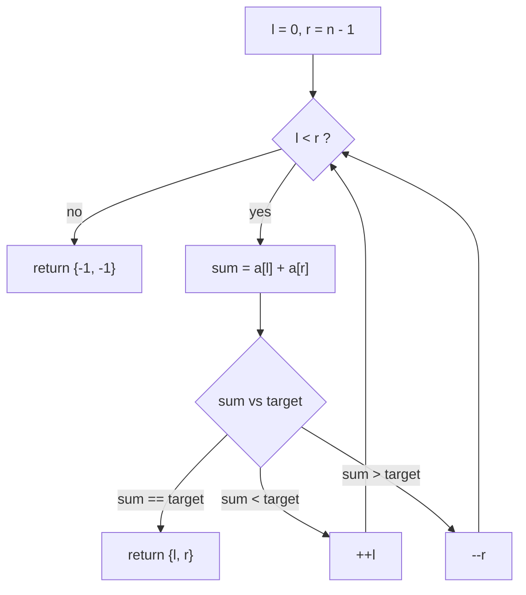
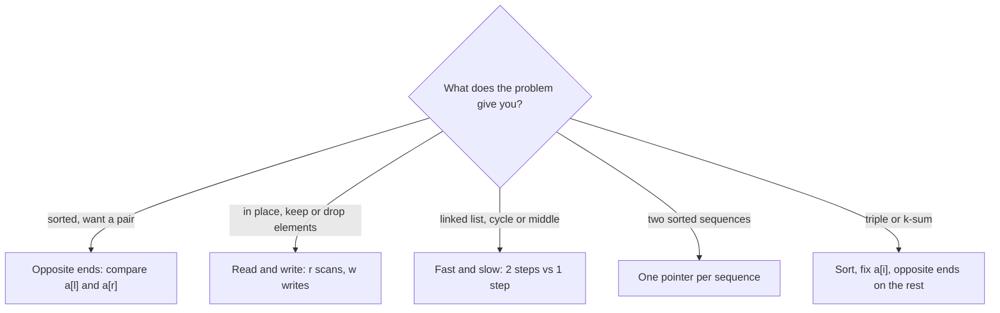

# Two Pointers

> Move two indices through a sequence, using an ordering or invariant to decide which one moves, so one pass replaces a nested loop.

## When to use

Signals in the statement:

- The input is a sorted array or string, or you are allowed to sort it first (the order does not have to be kept).
- You need a pair (or triple) with a given sum, difference or property.
- "In place", "O(1) extra space", "remove/move/partition elements" on an array.
- Palindrome checks, or comparing a sequence with a reversed view of itself.
- A linked list where you cannot index (cycle, middle node, k-th from the end).
- The brute force is two nested loops over `i < j`, and a decision at `(i, j)` rules out a whole row or column of pairs.

When NOT to use it:

- The array is unsorted and order must be kept (a hash map is usually the tool for pairs).
- The answer depends on a contiguous range with a running condition (a count, a set of distinct values). That is a
  sliding window.
- The search is over a value range, not over positions (see binary search).

## Core idea

Two indices replace the pair `(i, j)` of a nested loop. Each step, look at the two elements and decide which pointer
can move. It must be safe to move it: every pair you skip cannot be the answer. That argument is what makes the
pattern correct, so state it before you code.

Opposite ends, sorted array, target sum 10:

```txt
 index:  0  1  2  3  4  5
 value: [1  3  4  6  8  11]
         l              r      1 + 11 = 12 > 10 -> r moves left (11 is too big even with the smallest, 1)
         l           r         1 +  8 =  9 < 10 -> l moves right (1 is too small even with the biggest left, 8)
            l        r         3 +  8 = 11 > 10 -> r moves left
            l     r            3 +  6 =  9 < 10 -> l moves right
               l  r            4 +  6 = 10      -> found (2, 3)
```

Same direction (read and write pointers), building the answer in place:

```txt
 before: [1  1  2  2  2  3]
          w  r                 r scans every element, w marks where the next kept element goes
 after:  [1  2  3  .  .  .]    keep a[r] only when it differs from the last kept value; length = w
```

Decision flow of the opposite-ends loop (`twoSumSorted` in the template). The state is `l` and `r`. Each step moves
exactly one pointer, so the loop ends after at most `n - 1` steps:



Which shape to pick, by how the statement lets you decide which pointer moves:



## Template

Two shapes cover most problems. Both compile with `g++ -std=c++20 -Wall -Wextra`.

```cpp
#include <iostream>
#include <utility>
#include <vector>
using namespace std;

// Opposite ends: sorted array, find a pair summing to target (indices), or {-1, -1}.
pair<int, int> twoSumSorted(const vector<int>& a, int target) {
    int l = 0, r = static_cast<int>(a.size()) - 1;
    while (l < r) {
        int sum = a[l] + a[r];
        if (sum == target) return {l, r};
        if (sum < target) {
            ++l;  // need a bigger sum: only moving l right can help
        } else {
            --r;  // need a smaller sum: only moving r left can help
        }
    }
    return {-1, -1};
}

// Same direction (read/write): keep each value at most once in a sorted array, in place.
// Returns the new length.
int removeDuplicates(vector<int>& a) {
    int w = 0;  // a[0..w) is the answer built so far
    for (int r = 0; r < static_cast<int>(a.size()); ++r) {
        if (w == 0 || a[r] != a[w - 1]) a[w++] = a[r];
    }
    return w;
}

int main() {
    auto [i, j] = twoSumSorted({1, 3, 4, 6, 8, 11}, 10);
    cout << i << ' ' << j << '\n';  // 2 3
    vector<int> v{1, 1, 2, 2, 2, 3};
    int n = removeDuplicates(v);
    cout << n << ':';
    for (int k = 0; k < n; ++k) cout << ' ' << v[k];
    cout << '\n';  // 3: 1 2 3
    auto [x, y] = twoSumSorted({1, 2, 3}, 100);
    cout << x << ' ' << y << '\n';  // -1 -1
}
```

## Walkthrough

`twoSumSorted({1, 3, 4, 6, 8, 11}, 10)`:

| step | l | r | a[l] + a[r] | compare with 10 | move    |
|------|---|---|-------------|-----------------|---------|
| 1    | 0 | 5 | 12          | too big         | `--r`   |
| 2    | 0 | 4 | 9           | too small       | `++l`   |
| 3    | 1 | 4 | 11          | too big         | `--r`   |
| 4    | 1 | 3 | 9           | too small       | `++l`   |
| 5    | 2 | 3 | 10          | equal           | return  |

Result `{2, 3}`. Check the skip argument at step 1: `a[5] = 11` is too big even with the smallest element, so 11 is
in no valid pair and dropping `r` loses nothing.

## Variants

- **Opposite ends** (`l` starts at 0, `r` at `n - 1`): pair sums on a sorted array, palindrome checks, and greedy
  shrinking such as container with most water (move the pointer at the shorter side).
- **Same direction, read and write** (`w <= r`): remove duplicates or a value in place, move zeroes, stable partition.
- **Fast and slow** (slow moves 1 step, fast moves 2): cycle detection and the middle of a linked list.
- **Fix one element, sweep two pointers**: k-sum. Sort, fix `a[i]`, then run the opposite-ends scan on the rest. Skip
  equal neighbours to avoid duplicate results.
- **Two pointers on two sequences**: merge two sorted arrays, or check that one string is a subsequence of another.

## Complexity

- Time: O(n), where `n` is the array length. Each pointer only moves in one direction, so together they make at most
  `n` moves. Add O(n log n) if you have to sort first, and multiply by `n` for the fix-one-element variant (O(n^2)).
- Space: O(1) extra, apart from the output.

## Common mistakes and edge cases

- Using `l <= r` when you need two distinct elements (a pair). Use `l < r`. Use `l <= r` only when a single element
  is a valid answer, as in a palindrome middle.
- Moving the wrong pointer. Write down why the skipped pairs cannot be the answer before you code it.
- Applying opposite ends to an unsorted array. The skip argument only holds because of the order.
- Empty input, one element, and all elements equal.
- `int` overflow in `a[l] + a[r]` when values are near the `int` limits. Use `long long` if the constraints allow it.
- In the fast and slow variant, check `fast && fast->next` before moving `fast` two steps.
- The read and write variant: do not forget that the answer is `a[0..w)`, and that the elements after `w` are
  unspecified.

## Related patterns

- Sliding window: also two indices moving in one direction, but the pair is a window `[l..r]`
  whose contents you track. If the statement talks about a contiguous subarray or substring, think window. If it talks
  about a pair of elements, think two pointers.
- Binary search: also discards part of the search space each step, but by halving. Two pointers
  discards one element per step and needs no midpoint.
- Hash map: finds a pair in O(n) on unsorted input at O(n) space. Two pointers needs sorted input and O(1) space.

## Practice ladder

Check the difficulty labels on the site. Scaffold one with `/problem-readme`.

- LeetCode 125: Valid Palindrome (Easy)
- LeetCode 26: Remove Duplicates from Sorted Array (Easy)
- LeetCode 283: Move Zeroes (Easy)
- LeetCode 141: Linked List Cycle (Easy)
- LeetCode 167: Two Sum II - Input Array Is Sorted (Medium)
- LeetCode 11: Container With Most Water (Medium)
- LeetCode 75: Sort Colors (Medium)
- LeetCode 15: 3Sum (Medium)
- LeetCode 42: Trapping Rain Water (Hard)

## Problems
